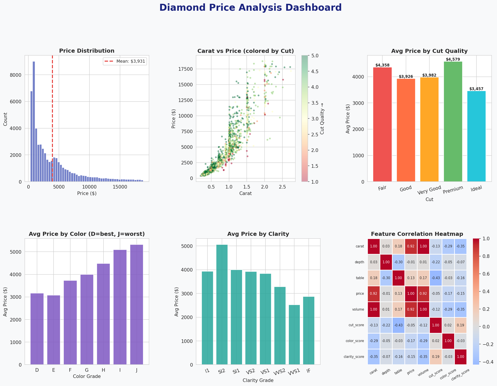
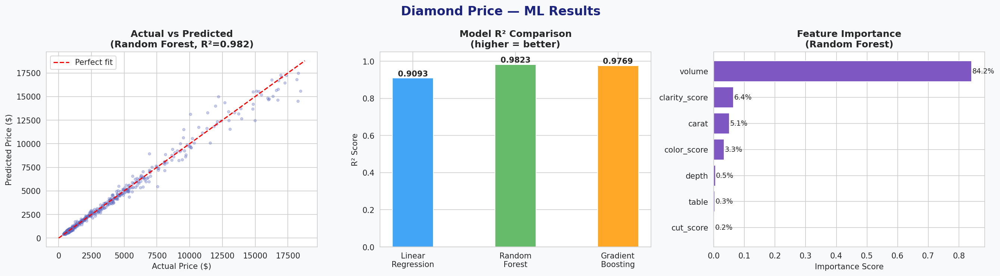

# 💎 Diamond Price Analysis & Prediction

End-to-end data science project on 54,000+ real diamond records — covering data cleaning, exploratory analysis, feature engineering, and ML regression with 3 models compared.



---

## 📌 Problem Statement

Predict diamond prices based on physical and quality attributes (carat, cut, color, clarity, dimensions) — and uncover what actually drives diamond pricing.

---

## 📊 Dataset

- **Source:** Real diamonds dataset (53,940 records)
- **Features:** Carat, Cut, Color, Clarity, Depth, Table, x, y, z dimensions
- **Target:** Price (USD)
- **Price range:** $326 — $18,823

---

## 🔧 What This Project Covers

### 1. Data Cleaning
- Removed 23 rows with physically impossible zero dimensions
- Removed outlier dimension values (data entry errors)
- Final clean dataset: 53,917 rows

### 2. Feature Engineering
- `volume` — x × y × z (physical size of diamond)
- `price_per_carat` — price efficiency metric
- `cut_score`, `color_score`, `clarity_score` — ordinal encoding preserving quality ranking

### 3. Exploratory Data Analysis

| Insight | Value |
|---|---|
| Carat vs Price correlation | 0.922 |
| Volume vs Price correlation | 0.924 |
| Most expensive cut (avg) | Premium ($4,579) |
| Most expensive color (avg) | J ($5,324) |

**Counterintuitive finding:** Fair cut diamonds cost more on average than Ideal cut — because Fair cut diamonds tend to be physically larger, and size dominates price over cut quality.



### 4. Machine Learning — Price Prediction

Trained and compared 3 regression models:

| Model | R² Score | MAE |
|---|---|---|
| Linear Regression | 0.9093 | $836 |
| Random Forest | **0.9823** | **$273** |
| Gradient Boosting | 0.9769 | $337 |

**Best model:** Random Forest — predicts diamond price within $273 on average.

**Top price predictors:**
- Volume (84.2%) — physical size matters most
- Clarity score (6.4%)
- Carat (5.1%)

---

## 🛠️ Tech Stack

- **Python** — Pandas, NumPy
- **Visualization** — Matplotlib, Seaborn
- **ML** — Scikit-learn (Linear Regression, Random Forest, Gradient Boosting)

---

## 🚀 How to Run

```bash
git clone https://github.com/naavveen/diamond-price-prediction
cd diamond-price-prediction
pip install pandas numpy matplotlib seaborn scikit-learn
python diamond_project.py
```

---

## 📁 Project Structure

```
diamond-price-prediction/
│
├── diamond_project.py          # Main script
├── diamond_eda_dashboard.png   # EDA visualizations
├── diamond_ml_results.png      # ML results dashboard
└── README.md
```

---

## 💡 Key Takeaway

Volume (physical size) is by far the strongest price predictor at 84% importance — more influential than carat weight alone. This suggests buyers pay primarily for visible size, not just weight. Random Forest achieved R² of 0.98, meaning the model explains 98% of price variance.

---

*Project by [Naveen](https://github.com/naavveen) | [LinkedIn](https://linkedin.com/in/naveen-matlotia)*
