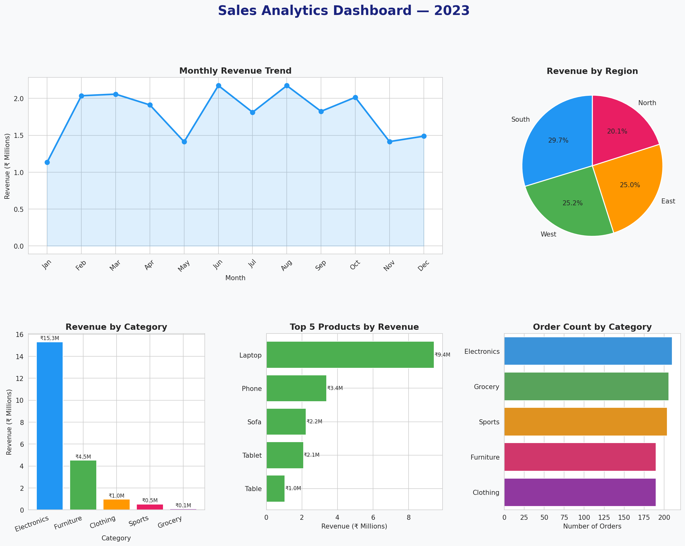

# 📊 Sales Analytics Dashboard

End-to-end sales data analysis project covering data cleaning, exploratory analysis, and business insights visualization across products, regions, and time.



---

## 📌 Problem Statement

Analyze 1000+ sales transactions to identify revenue trends, top-performing products, regional performance, and category insights — the kind of analysis businesses need to make data-driven decisions.

---

## 📊 Dataset

- **Type:** Realistic synthetic dataset (1,000 transactions)
- **Features:** Date, Region, Category, Product, Quantity, Unit Price, Discount
- **Intentional flaws added:** Missing values, duplicate rows (for cleaning demo)

---

## 🔧 What This Project Covers

### 1. Data Cleaning
- Removed 10 duplicate rows
- Filled missing Quantity with median
- Filled missing Unit Price with median
- Filled missing Region with mode
- Fixed data types (date parsing, integer conversion)

### 2. Feature Engineering
- `revenue` — Quantity × Unit Price × (1 - Discount)
- `month` / `month_name` — extracted from date for trend analysis

### 3. Key Business Insights

| Metric | Value |
|---|---|
| Total Revenue | ₹21,457,696 |
| Top Category | Electronics |
| Top Region | South |
| Best Month | June |
| Top Product | Laptop |

### 4. Dashboard — 6 Charts
- Monthly revenue trend (line chart)
- Revenue by region (pie chart)
- Revenue by category (bar chart)
- Top 5 products by revenue (horizontal bar)
- Order count by category (bar chart)

---

## 🛠️ Tech Stack

- **Python** — Pandas, NumPy
- **Visualization** — Matplotlib, Seaborn

---

## 🚀 How to Run

```bash
git clone https://github.com/naavveen/sales-analytics
cd sales-analytics
pip install pandas numpy matplotlib seaborn
python sales_analytics.py
```

---

## 📁 Project Structure

```
sales-analytics/
│
├── sales_analytics.py      # Main script
├── sales_dashboard.png     # Output dashboard
└── README.md
```

---

## 💡 Key Takeaway

Electronics dominated revenue despite not having the highest order count — driven by high unit prices. June showed the strongest monthly performance, suggesting seasonal demand patterns worth investigating further.

---

*Project by [Naveen](https://github.com/naavveen) | [LinkedIn](https://linkedin.com/in/naveen-matlotia)*
